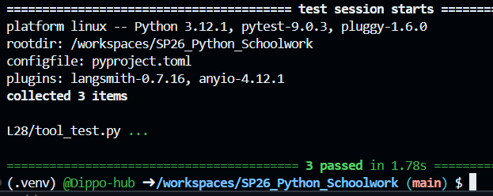

The tool name expresses its function: a compounded interest calculator.
Used for when interest is applied multiple times in a year on a principal amount, often over multiple years, such as on a savings account or a monthly car payment.

Installation - Requires math module

Usage Example:

Import math
from tool import compounded_interest_calculator

# Principal = 1000; Rate = 0.05; Time = 10 years; Frequency = 4 times/year

print(compounded_interest_calculator(1000, 0.05, 10, 4))

#Expected:
{"total_payment": 1643.62, "unit": "USD", "detail": 
            "Calculated for 1000 at 5.0% over 10 years, compounded 4 times per year. Total interest will be 643.62 USD."} 

Our team has not settled on a single domain yet, but this will be a useful tool if we settle on the financial domain. Instead of confusing between various formulas, a langchain model will use this to give a consistent answer every time.

Pytest results:
